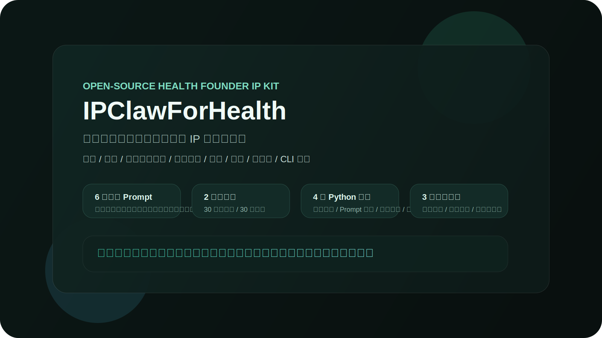

<div align="center">

# 🏥 IPClawForHealth

**给大健康行业创始人的开源口播 IP 内容工具箱。**

[](LICENSE)
[](https://github.com/AIPMAndy/IPClawForHealth/stargazers)
[](https://github.com/AIPMAndy/IPClawForHealth/graphs/contributors)

[English](README_EN.md) | **简体中文**



</div>

> `IPClawForHealth` 不是一个已经封装好的 SaaS。
>
> 它是一套可以直接复用的开源内容资产仓，核心是把大健康行业创始人做口播 IP 需要的关键材料拆成：定位 Prompt、选题库、脚本模板、平台安全改写、成交话术、变现设计、工作流、案例库和 4 个可运行的小工具。

一句话更适合对外销售的产品承诺：

**帮助大健康行业创始人搭建一套更适合中国平台生态的创始人 IP 内容系统，兼顾公开表达、持续输出和商业承接。**

## 这个仓库里现在有什么

- `prompts/`：6 个核心 Prompt，覆盖定位、选题、脚本、平台安全改写、话术、变现。
- `workflows/`：2 套执行路径，分别解决「30 分钟出片」和「30 天系统打造」。
- `examples/`：包含教学示意案例和一份从定位到脚本的完整实战示例。
- `docs/`：包含健康内容合规清单、中国平台限流避坑指南和一份商业化方案。
- `tools/`：4 个 Python CLI 工具，分别负责选题生成、AI Prompt 生成、脚本优化、风险检查。
- `index.html`：1 个静态落地页，可直接作为仓库展示页或项目介绍页。

## 为什么它比泛 Prompt 包更有用

| 维度 | 通用内容模板 | IPClawForHealth |
|------|:------------:|:---------------:|
| 聚焦大健康行业 | ❌ | ✅ |
| 站在创始人/专家视角设计 | ⚠️ | ✅ |
| 兼顾公开表达和商业承接 | ⚠️ | ✅ |
| 有中国平台安全表达资产 | ❌ | ✅ |
| 提供成套工作流 | ❌ | ✅ |
| 附带可运行小工具 | ❌ | ✅ |
| 可直接作为项目展示入口 | ❌ | ✅ |

## 🚀 30 秒快速开始

```bash
git clone https://github.com/AIPMAndy/IPClawForHealth.git
cd IPClawForHealth

# 1) 本地打开介绍页
python3 -m http.server 8788
# 然后访问 http://127.0.0.1:8788

# 2) 先做定位诊断
cat prompts/定位诊断.md

# 3) 生成一轮选题
python3 tools/topic_generator.py

# 4) 让 AI 生成脚本 Prompt
python3 tools/ai_prompt_generator.py

# 5) 优化成更适合口播的版本
python3 tools/script_optimizer.py

# 6) 发布前扫一遍风险词
python3 tools/content_risk_checker.py --platform douyin
```

## 推荐使用顺序

1. `prompts/定位诊断.md`
   明确你要服务的细分人群、专业优势和差异化表达。
2. `prompts/选题库.md`
   找到适合自己阶段的内容切口，快速进入选题状态。
3. `prompts/脚本模板.md` + `tools/ai_prompt_generator.py`
   先产出初稿，再把内容改成适合口播的视频脚本。
4. `tools/script_optimizer.py`
   估算时长、口语化替换，并给出一个更适合 60 秒试读的版本。
5. `tools/content_risk_checker.py` + `prompts/平台安全改写.md`
   在发布前先扫风险词，再把文案改成更适合公开平台的版本。
6. `docs/健康内容合规清单.md` + `docs/中国平台限流避坑指南.md`
   用于控制健康行业表达边界和国内平台风险。
7. `prompts/话术库.md` + `prompts/变现设计.md`
   把内容链路延伸到私域转化、成交设计和产品承接。

## 📦 仓库结构

```text
IPClawForHealth/
├── assets/
│   └── cover.svg             # README 封面图
├── docs/
│   └── 健康内容合规清单.md   # 健康行业内容表达自检
│   ├── 中国平台限流避坑指南.md # 国内平台发布与限流避坑
│   └── 商业化方案.md         # 对外销售和服务包设计
├── examples/
│   ├── 从定位到脚本实战示例.md # 第一次使用可直接照着走
│   └── 案例库.md            # 教学示意案例拆解
├── prompts/
│   ├── 定位诊断.md          # 创始人 IP 定位
│   ├── 选题库.md            # 行业专属选题
│   ├── 脚本模板.md          # 口播脚本模板
│   ├── 平台安全改写.md      # 平台适配与风险表达改写
│   ├── 话术库.md            # 咨询与成交话术
│   └── 变现设计.md          # 产品梯度与转化设计
├── tools/
│   ├── README.md
│   ├── topic_generator.py
│   ├── ai_prompt_generator.py
│   ├── script_optimizer.py
│   └── content_risk_checker.py
├── workflows/
│   ├── 快速出片流.md
│   └── 深度打造流.md
├── index.html               # 静态项目介绍页
├── README.md
└── README_EN.md
```

## 适合谁

- 健身教练、营养师、中医/养生馆主、健康管理顾问等大健康从业者
- 想把专业能力转成可持续内容输出的创始人或个人品牌操盘手
- 想把内容策划、私域咨询、成交承接整理成 SOP 的团队
- 想做内容，但担心国内平台敏感、表达踩雷、容易限流的人

## 如果你准备把它卖出去，最该卖什么

不要把它卖成“爆量神器”或“避审核工具”。  
更适合卖成：

- 更适合中国平台生态的健康内容表达系统
- 从定位到脚本再到风险检查的创始人 IP 起步系统
- 兼顾公开表达、平台风险和商业承接的内容工具包

## 当前最值得继续补强的方向

- 增加更多细分赛道案例，尤其是睡眠、康复、心理健康、女性健康等。
- 给更多核心 Prompt 增加更完整的「输入示例 / 输出示例」。
- 增加按平台区分的标题模板、评论区模板和成交承接模板。
- 为 `index.html` 补充真实截图或录屏，增强 GitHub 首屏转化。

## 🗺️ Roadmap

- [x] 核心 Prompt 结构
- [x] 选题库
- [x] 脚本模板
- [x] 话术库
- [x] 变现设计 Prompt
- [x] 快速出片工作流
- [x] 深度打造工作流
- [x] Python 辅助工具
- [x] 项目介绍页
- [x] 第一次使用示例
- [x] 健康内容合规清单
- [x] 中国平台限流避坑指南
- [x] 平台安全改写 Prompt
- [x] 内容风险检查工具
- [x] 商业化方案
- [ ] 更多垂类案例
- [ ] 更多 Prompt 输入/输出样例
- [ ] 更强的展示素材（截图 / GIF / demo）

## 🤝 贡献

欢迎通过 [Issues](https://github.com/AIPMAndy/IPClawForHealth/issues) 提交问题或建议，也欢迎直接发起 PR。

如果你补充的是行业案例、Prompt 模板或转化 SOP，优先写清楚：

- 适用角色
- 输入条件
- 输出结果
- 是否包含合规或敏感表达风险

## ⚠️ 合规提醒

这是一个面向健康行业的内容工具仓，不是医疗建议库。  
涉及疾病、药物、诊疗、慢病管理、特殊人群等内容时，建议先对照 `docs/健康内容合规清单.md` 做自检。

## 📄 License

本项目使用 [Apache 2.0 License](LICENSE)。

## 👨‍💻 作者

**AI酋长Andy**

- GitHub: [AIPMAndy](https://github.com/AIPMAndy)
- 项目主页: [IPClawForHealth](https://github.com/AIPMAndy/IPClawForHealth)
